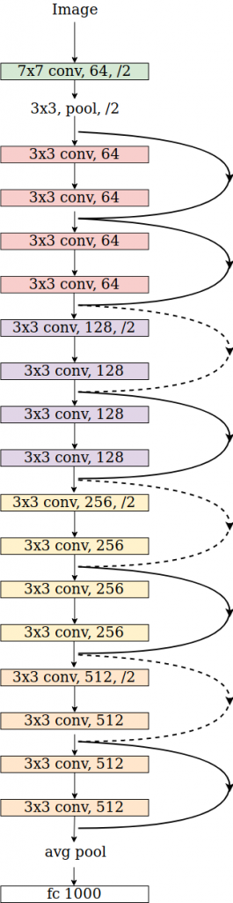

# Cifar10_pytorch 初次训练

> Author: Steven,
>
> Date: 2020-05-19

## 基本

- 任务领域：图片分类
- 数据集：`CIFAR-10`。该数据集共有60000张彩色图像，这些图像是32*32，分为10个类，每类6000张图。这里面有50000张用于训练，构成了5个训练批，每一批10000张图；另外10000用于测试，单独构成一批。测试批的数据里，取自10类中的每一类，每一类随机取1000张。
- 模型：基于Pytorch流行的模型集合：`vgg/resnet18/googlenet/densenet121/mobilenet/dpn92/senet18`
  - vgg:
  - resnet18:
  - googlenet:
  - densenet:
  - mobilenet:


## 实现

1. 训练Python部分：

```python
        for batch_idx, (inputs, targets) in enumerate(test_loader):
            inputs, targets = inputs.to(device), targets.to(device)
            outputs = net(inputs)
            loss = criterion(outputs, targets)

            test_loss += loss.item()
            _, predicted = outputs.max(1)
            total += targets.size(0)
            correct += predicted.eq(targets).sum().item()

            acc = 100. * correct / total

            progress_bar(batch_idx, len(test_loader), 'Loss: %.3f | Acc: %.3f%% (%d/%d)'
                         % (test_loss / (batch_idx + 1), 100. * correct / total, correct, total))
```


2. 搜索空间：

```json
{
    "lr": {"_type":"choice", 
         "_value":[0.1, 
                   0.01, 
                   0.001, 
                   0.0001
                  ]
        },
    "optimizer":{"_type":"choice", 
                 "_value":["SGD",
                           "Adadelta",
                           "Adagrad",
                           "Adam",
                           "Adamax"
                          ]
                },
    "model":{"_type":"choice", 
             "_value":["vgg",
                       "resnet18",
                       "googlenet",
                       "densenet121",
                       "mobilenet",
                       "dpn92",
                       "senet18"
                      ]
            }
}

```


3. 配置文件：

```yaml
authorName: Steven Yan
experimentName: my_pytorch_cifar10
trialConcurrency: 4
maxExecDuration: 100h
maxTrialNum: 10
trainingServicePlatform: local
searchSpacePath: search_space.json
#choice: true, false
useAnnotation: false
tuner:
	# 可选用 Random Tuner
  builtinTunerName: TPE
  classArgs:
    #choice: maximize, minimize
    optimize_mode: maximize
trial:
  command: python3 main.py
  codeDir: .
  gpuNum: 1
localConfig:
  maxTrialNumPerGpu:  2

```


## 结果

> 由于当前机器没有独立显卡，无法使用CUDA运算平台，所以实验结果暂时还不完整。
>
> 可以大概猜测结果。


### 结果分析：

CIFAR-10的数据集相对于MNIST要复杂一些，trial的计算时间长得多。从结果分析来看，模型为：densenet121、优化器为Adamax、学习率为0.001下取得的准确度最高。